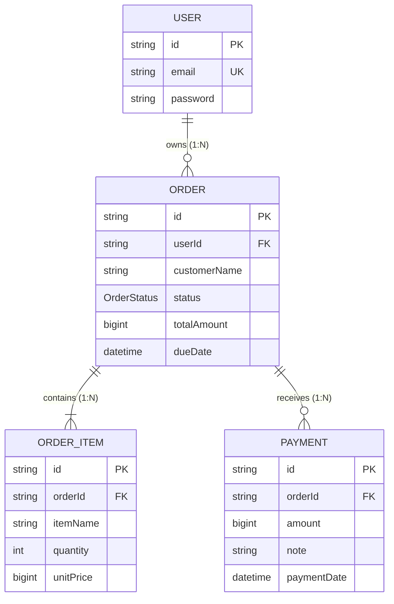

# Order & Settlements Platform

An enterprise-grade **Order Management and Settlement Platform** built with **Fastify**, **Prisma ORM**, **PostgreSQL**, **TypeScript**, **React**, and **TailwindCSS**.

---

## 📚 Documentation
- 📖 [API Documentation](file:///home/neautrino/Code/projects/order-and-settlements/docs/api.md) — Comprehensive HTTP endpoint specifications, request/response schemas, and validation rules.
- 📐 [Data Model & ER Diagrams](file:///home/neautrino/Code/projects/order-and-settlements/docs/data-model.md) — Entity-Relationship diagrams, database schema, data dictionary, and state transition machine.
- 📋 [Requirements Matrix](file:///home/neautrino/Code/projects/order-and-settlements/docs/requirements.md) — Feature checklist and project scope requirements.

---

## 📊 Entity Relationship (ER) Overview

---

## 🚀 Key Features
- **User Authentication**: Secure JWT-based registration, login, and user profile management.
- **Order Lifecycle**: Create, view, update, and delete orders with automatic total amount calculation.
- **Settlement & Payments**: Partial payments, full settlements, and automated overpayment protection.
- **Race Condition Prevention**: Database row locking (`SELECT FOR UPDATE`) during payment processing.
- **Real-time Status Resolution**: Automatic dynamic status transitions (`PENDING`, `PARTIALLY_PAID`, `PAID`, `OVERDUE`).
- **Audit Compliance**: Protection against modifying or deleting orders with recorded payment transactions.

---

## 🛠 Tech Stack
- **Backend**: Bun runtime, Fastify, Zod validation, Prisma ORM 6, PostgreSQL
- **Frontend**: React 18, Vite, TypeScript, TailwindCSS, Lucide Icons
