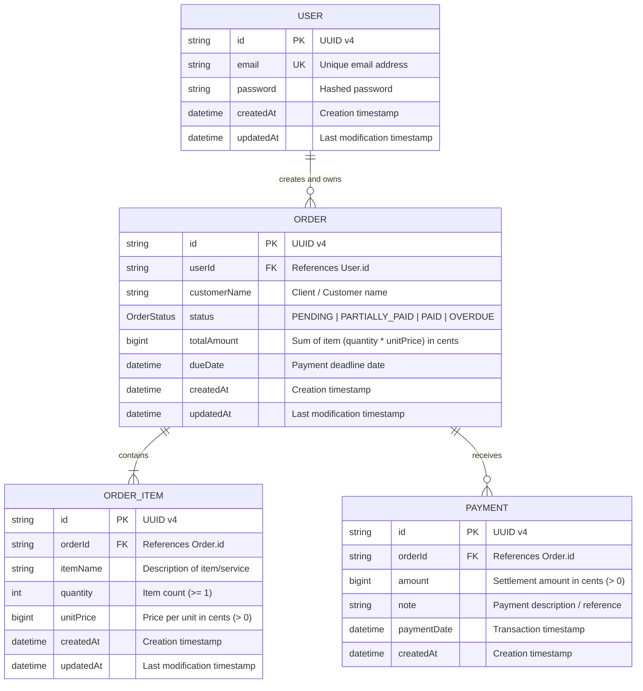
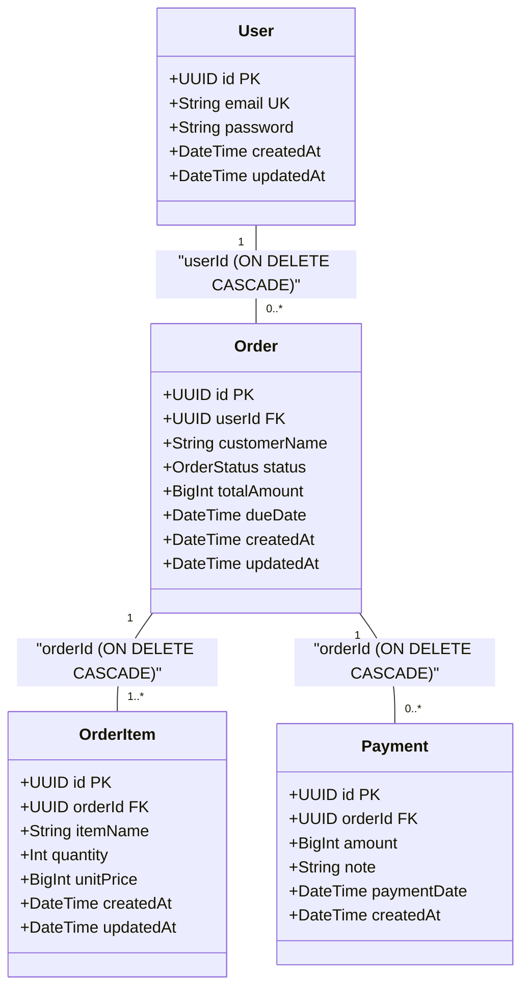
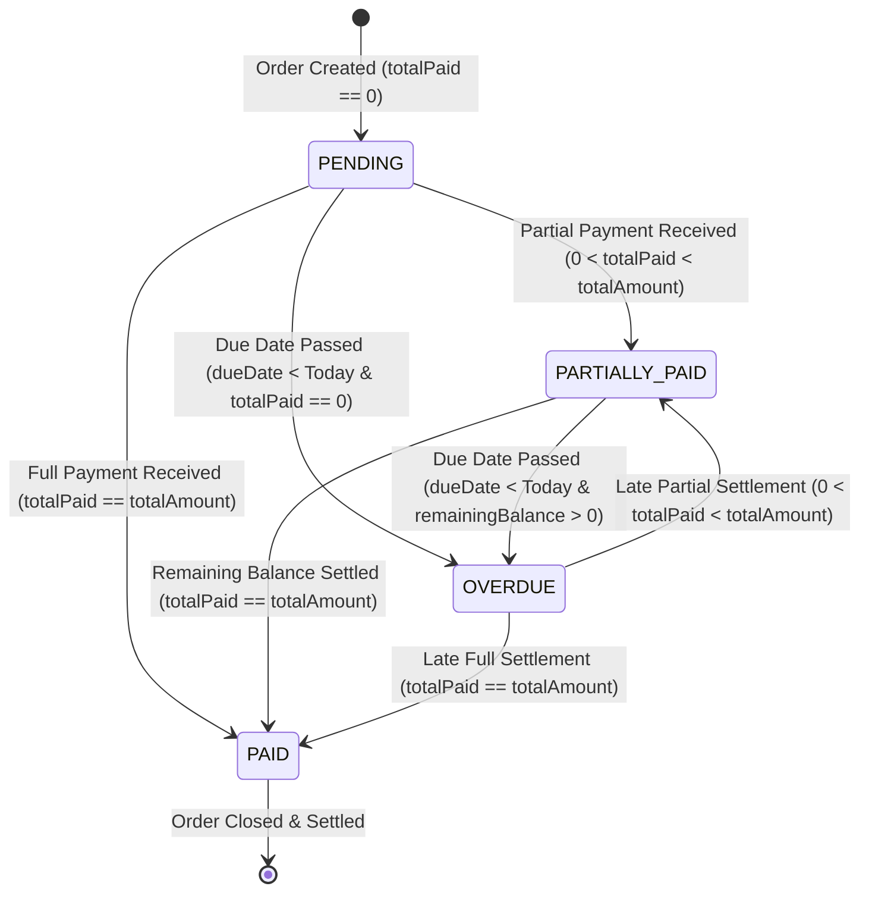

# Order & Settlements Data Model & ER Diagrams

This document provides complete data architecture documentation, including **Entity-Relationship (ER) Diagrams**, data dictionary, state transition diagrams, indexes, and integrity rules for the **Order & Settlements System**.

---

## 📋 Table of Contents
- [Entity Relationship Diagrams (ERD)](#-entity-relationship-diagrams-erd)
  - [1. Visual ASCII ER Diagram](#1-visual-ascii-er-diagram)
  - [2. Mermaid ER Diagram](#2-mermaid-er-diagram)
  - [3. Relational Schema Diagram](#3-relational-schema-diagram)
- [Architecture & Storage Strategy](#-architecture--storage-strategy)
- [Enums & State Machine Diagram](#-enums--state-machine-diagram)
- [Relationship & Cardinality Matrix](#-relationship--cardinality-matrix)
- [Data Dictionary](#-data-dictionary)
  - [1. `User` Entity](#1-user-entity)
  - [2. `Order` Entity](#2-order-entity)
  - [3. `OrderItem` Entity](#3-orderitem-entity)
  - [4. `Payment` Entity](#4-payment-entity)
- [Database Indexes & Performance](#-database-indexes--performance)
- [Data Integrity & Business Constraints](#-data-integrity--business-constraints)

---

## 📐 Entity Relationship Diagrams (ERD)

### 1. Visual ASCII ER Diagram

```
+-----------------------------------+
|               USER                |
+-----------------------------------+
| PK | id         : String (UUID)   |
| UK | email      : String          |
|    | password   : String (Hashed) |
|    | createdAt  : DateTime        |
|    | updatedAt  : DateTime        |
+-----------------------------------+
                  |
                  | 1 (owns)
                  |
                  | N
                  v
+-----------------------------------+
|               ORDER               |
+-----------------------------------+
| PK | id           : String (UUID) |
| FK | userId       : String (UUID) |
|    | customerName : String        |
|    | status       : OrderStatus   |
|    | totalAmount  : BigInt        |
|    | dueDate      : DateTime      |
|    | createdAt    : DateTime      |
|    | updatedAt    : DateTime      |
+-----------------------------------+
       |                     |
       | 1 (contains)        | 1 (receives)
       |                     |
       | N                   | N
       v                     v
+-----------------------+   +-----------------------+
|      ORDER_ITEM       |   |        PAYMENT        |
+-----------------------+   +-----------------------+
| PK | id        : UUID |   | PK | id        : UUID |
| FK | orderId   : UUID |   | FK | orderId   : UUID |
|    | itemName  : Str  |   |    | amount    : BigInt|
|    | quantity  : Int  |   |    | note      : Str  |
|    | unitPrice : BigInt|  |    | paymentDate: Date |
|    | createdAt : Date |   |    | createdAt : Date |
+-----------------------+   +-----------------------+
```

---

### 2. Mermaid ER Diagram



---

### 3. Relational Schema Diagram



---

## 🏗 Architecture & Storage Strategy

- **Database System**: PostgreSQL managed via **Prisma ORM v6**
- **Primary Keys**: Globally unique UUID v4 strings (`@default(uuid())`) across all tables.
- **Monetary Precision**: Stored using 64-bit BigInt (`BIGINT` / `BigInt`) representing minor currency units (**cents** for USD).
  - *Example*: $150.50 is stored as integer `15050` cents.
  - *Rationale*: Guarantees zero floating-point rounding errors during aggregate financial calculations (`SUM(amount)`).
- **Referential Integrity**: Standard SQL foreign key constraints with `ON DELETE CASCADE`.

---

## 🔄 Enums & State Machine Diagram

### Order Status Transition Workflow

```
       +-------------------+
       |      PENDING      |  (Initial State: totalPaid == 0)
       +---------+---------+
                 |
     +-----------+-----------+
     |           |           |
     v           v           v
+---------+ +---------+ +---------+
|PARTIALLY| |  PAID   | | OVERDUE |
|  PAID   | +---------+ +---------+
+----+----+
     |           ^
     +-----------+
```



---

## 🔗 Relationship & Cardinality Matrix

| Parent Table | Child Table | Foreign Key | Cardinality | Delete Action | Business Logic Constraint |
| :--- | :--- | :--- | :--- | :--- | :--- |
| `User` | `Order` | `Order.userId` | **1 : N** (One-to-Many) | `CASCADE` | Users only access their own orders. |
| `Order` | `OrderItem` | `OrderItem.orderId` | **1 : N** (One-to-Many) | `CASCADE` | An order must contain at least 1 item. |
| `Order` | `Payment` | `Payment.orderId` | **1 : N** (One-to-Many) | `CASCADE` | Cannot edit/delete Order if Payments exist. |

---

## 📖 Data Dictionary

### 1. `User` Entity
Stores authenticated user accounts.

| Column | Type | Attributes / Constraints | Default | Description |
| :--- | :--- | :--- | :--- | :--- |
| `id` | `String` | `@id`, UUID v4 | `uuid()` | Primary Key |
| `email` | `String` | `@unique` | - | User login email address |
| `password` | `String` | Hashed string | - | Password hash generated via Bun.password |
| `createdAt` | `DateTime` | Timestamp | `now()` | Registration timestamp |
| `updatedAt` | `DateTime` | `@updatedAt` | - | Profile modification timestamp |

---

### 2. `Order` Entity
Represents customer invoices/orders.

| Column | Type | Attributes / Constraints | Default | Description |
| :--- | :--- | :--- | :--- | :--- |
| `id` | `String` | `@id`, UUID v4 | `uuid()` | Primary Key |
| `userId` | `String` | `@relation(User.id)`, `@index` | - | Foreign Key to `User.id` |
| `customerName` | `String` | Non-empty string | - | Client or buyer name |
| `status` | `OrderStatus` | Enum | `PENDING` | `PENDING \| PARTIALLY_PAID \| PAID \| OVERDUE` |
| `totalAmount` | `BigInt` | Minimum 1 | - | Total calculated amount in cents |
| `dueDate` | `DateTime` | `dueDate > Today` | - | Target payment deadline date |
| `createdAt` | `DateTime` | Timestamp | `now()` | Order creation timestamp |
| `updatedAt` | `DateTime` | `@updatedAt` | - | Order modification timestamp |

---

### 3. `OrderItem` Entity
Individual line items attached to an order.

| Column | Type | Attributes / Constraints | Default | Description |
| :--- | :--- | :--- | :--- | :--- |
| `id` | `String` | `@id`, UUID v4 | `uuid()` | Primary Key |
| `orderId` | `String` | `@relation(Order.id)`, `@index` | - | Foreign Key to `Order.id` |
| `itemName` | `String` | Non-empty string | - | Description of product or service |
| `quantity` | `Int` | Integer `>= 1` | - | Quantity ordered |
| `unitPrice` | `BigInt` | Integer `> 0` | - | Unit price per item in cents |
| `createdAt` | `DateTime` | Timestamp | `now()` | Creation timestamp |
| `updatedAt` | `DateTime` | `@updatedAt` | - | Item update timestamp |

---

### 4. `Payment` Entity
Ledger entries for partial and full payment transactions.

| Column | Type | Attributes / Constraints | Default | Description |
| :--- | :--- | :--- | :--- | :--- |
| `id` | `String` | `@id`, UUID v4 | `uuid()` | Primary Key |
| `orderId` | `String` | `@relation(Order.id)`, `@index` | - | Foreign Key to `Order.id` |
| `amount` | `BigInt` | Integer `> 0` | - | Payment amount in cents |
| `note` | `String` | Optional string | - | Payment memo/notes |
| `paymentDate` | `DateTime` | Timestamp | `now()` | Server-side generated execution timestamp |
| `createdAt` | `DateTime` | Timestamp | `now()` | Ledger entry timestamp |

---

## ⚡ Database Indexes & Performance

To optimize database query execution plans, indexes are maintained on high-frequency search and join keys:

```sql
-- Index on Order.userId for user order listings
CREATE INDEX "Order_userId_idx" ON "Order"("userId");

-- Index on OrderItem.orderId for order details join lookups
CREATE INDEX "OrderItem_orderId_idx" ON "OrderItem"("orderId");

-- Index on Payment.orderId for balance calculation aggregations
CREATE INDEX "Payment_orderId_idx" ON "Payment"("orderId");
```

---

## 🔒 Data Integrity & Business Constraints

1. **Calculated Total Amount**:
   - `Order.totalAmount = SUM(OrderItem.quantity * OrderItem.unitPrice)` computed atomically on creation or item revision.
2. **Preventing Overpayment**:
   - `Payment.amount <= (Order.totalAmount - SUM(Payment.amount))` evaluated inside a database transaction with row-level locks (`SELECT FOR UPDATE`).
3. **Audit Trail Protection**:
   - Deletions (`DELETE`) and modifications (`PATCH`) on `Order` are blocked at application level whenever `Payment` records exist for that order.
