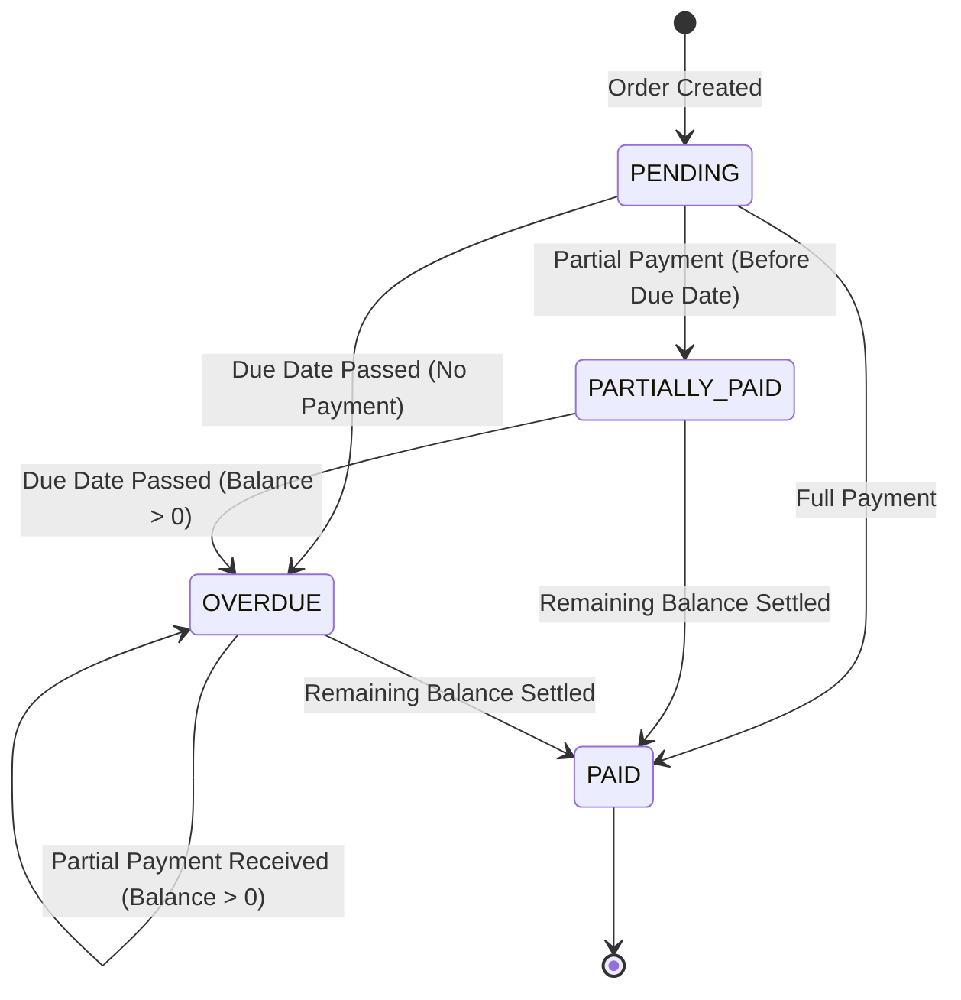

# Edge Cases & Failure Scenarios Specification

This document provides a concise reference for edge cases, validation rules, state machine invariants, and failure scenarios in the **Orders & Settlements API**.

---

## 1. Authentication & Security Edge Cases

| Scenario | Trigger / Payload | Expected System Response | HTTP Status |
| :--- | :--- | :--- | :---: |
| **Duplicate Registration** | Register with an email already in the DB | Rejects registration without revealing account details or modifying existing records. | `409 Conflict` |
| **Invalid Login Credentials** | Incorrect email or password provided | Rejects login; issues no JWT. Generic message prevents user enumeration. | `401 Unauthorized` |
| **Missing / Expired Token** | Protected endpoint call without token or with an expired JWT stored in client | Rejects request; state unmodified. Frontend clears stale local storage and redirects to `/login`. | `401 Unauthorized` |
| **Cross-User Data Access** | User A queries `/orders/:id` belonging to User B (ID manipulation) | Scope check fails. Strictly rejects request without revealing order existence. | `404 Not Found` |

---

## 2. Order Creation & Item Validation

| Field / Scenario | Rule & Violation Trigger | Backend Handling & Enforced Behavior | HTTP Status |
| :--- | :--- | :--- | :---: |
| **Empty Items List** | `items: []` | Orders must contain $\ge 1$ line item. | `400 Bad Request` |
| **Zero / Negative Quantity** | Line item `quantity <= 0` | Rejects payload. Quantity must be a positive integer ($> 0$). | `400 Bad Request` |
| **Zero / Invalid Unit Price** | Line item `unitPrice <= 0` | Rejects payload. Unit price must be a positive integer in cents ($> 0$). | `400 Bad Request` |
| **Same-Day / Past Due Date** | `dueDate <= Current Date` | Creation requires `dueDate > Current Date`. Same-day or historical due dates are rejected. | `400 Bad Request` |
| **Manipulated Order Total** | Client passes arbitrary `totalAmount` | Client-provided total is completely ignored. Server recalculates sum of `quantity * unitPrice`. | `201 Created` |

---

## 3. Order Lifecycle & Status State Machine

### Status Precedence Hierarchy
The effective order status is evaluated deterministically in order of priority:
1. `PAID` *(Highest)* — Total paid $\ge$ Total amount.
2. `OVERDUE` — Due date $< \text{Current Date}$ AND balance remaining $> 0$.
3. `PARTIALLY_PAID` — Total paid $> 0$ AND balance remaining $> 0$ AND due date $\ge \text{Current Date}$.
4. `PENDING` *(Lowest)* — Total paid $= 0$ AND due date $\ge \text{Current Date}$.

### Lifecycle Transitions Matrix



---

## 4. Order Immutability (Updates & Deletion)

To maintain financial auditability, order modification rules are strictly enforced:

* **Unpaid Orders (`totalPaid == 0`)**: Editable (`PATCH`) and Deletable (`DELETE`). Recalculates total if items change.
* **Settled / Active Financial Activity (`totalPaid > 0`)**: Completely immutable. Any `PATCH` or `DELETE` attempt returns `400 Bad Request`.

---

## 5. Payment Validation & Overpayment Prevention

All payment operations execute within an isolated database transaction (`SERIALIZABLE` or PostgreSQL row-level lock `FOR UPDATE`).

```text
               Payment Processing Sequence
               
Client            Fastify API                      PostgreSQL DB
  │                    │                                 │
  │── POST /payments ─>│                                 │
  │                    │── BEGIN TRANSACTION ───────────>│
  │                    │── SELECT ... FOR UPDATE ───────>│ (Locks Order Row)
  │                    │                                 │
  │                    │   [Recalculate Balance]         │
  │                    │   Remaining = Total - Paid      │
  │                    │                                 │
  │                    │── Payment Amount Validation ───>│
  │                    │   - Payment > 0?                │
  │                    │   - Payment <= Remaining?       │
  │                    │                                 │
  │                    │── INSERT Payment Record ───────>│
  │                    │── UPDATE Order Status ─────────>│
  │                    │── COMMIT ──────────────────────>│ (Unlocks Order Row)
  │<── 201 Created ────│                                 │
```

### Payment Validation Matrix

| Scenario | Condition | System Action | Status Code |
| :--- | :--- | :--- | :---: |
| **Zero / Negative Payment** | `amount <= 0` | Rejected immediately. | `400 Bad Request` |
| **Overpayment Attempt** | `amount > remainingBalance` | Rejected. Returns current `remainingBalance` in response body. | `400 Bad Request` |
| **Exact Settlement** | `amount == remainingBalance` | Payment recorded; status transitions to `PAID`. | `201 Created` |
| **Partial Payment** | `amount < remainingBalance` | Payment recorded; status updated (`PARTIALLY_PAID` or remains `OVERDUE`). | `201 Created` |
| **Payment on Settled Order** | `remainingBalance == 0` | Rejected. No balance remaining. | `400 Bad Request` |

---

## 6. Race Conditions & Concurrency Control

### 6.1 Concurrent Payment Collision
* **Scenario**: Two simultaneous payments ($A = \$700$, $B = \$500$) are submitted for an order with a $\$1,000$ balance.
* **Mechanism**: PostgreSQL row locking (`SELECT ... FOR UPDATE`).
* **Execution**: Transaction $A$ locks the order row and commits $\$700$ (remaining balance becomes $\$300$). Transaction $B$ waits for lock release, reads updated remaining balance ($\$300$), evaluates $\$500 > \$300$, and safely rejects with `400 Bad Request`.

### 6.2 Frontend Accidental Double-Click Protection
* **Mechanism**: Swipe-to-Confirm UI Component (`SwipeButton.tsx`).
* **Execution**: To prevent accidental double-clicks or rapid consecutive taps on mobile and web devices, payment confirmation requires deliberate gesture drag/swipe engagement. Upon completion, the component immediately transitions into a disabled loading state until request resolution.

### 6.3 Stale Frontend Calculations
* **Scenario**: Client calculates payment based on informational `/payments/calculate/:id` balance, but another payment completes before submission.
* **Mechanism**: The backend **never trusts** client-provided balances or previous read calculations. Remaining balance is calculated dynamically inside the write transaction.

---

## 7. System Invariants & Financial Audit Rules

The system guarantees that the following mathematical and logical invariants hold under all operations:

1. **Non-Negativity**: $\text{totalPaid} \ge 0$, $\text{remainingAmount} \ge 0$.
2. **Conservation of Balance**: $\text{remainingAmount} = \text{totalAmount} - \text{totalPaid}$.
3. **Overpayment Ceiling**: $\text{totalPaid} \le \text{totalAmount}$.
4. **Transaction Integrity**: Payment insert and order status updates are **atomic**. Failures roll back completely.
5. **Minor Units Consistency**: All monetary amounts are handled strictly as integer cents (`BigInt`).
